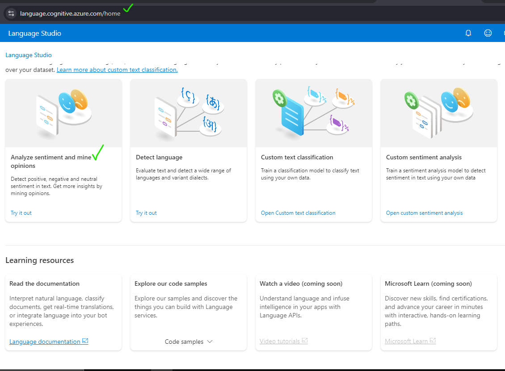
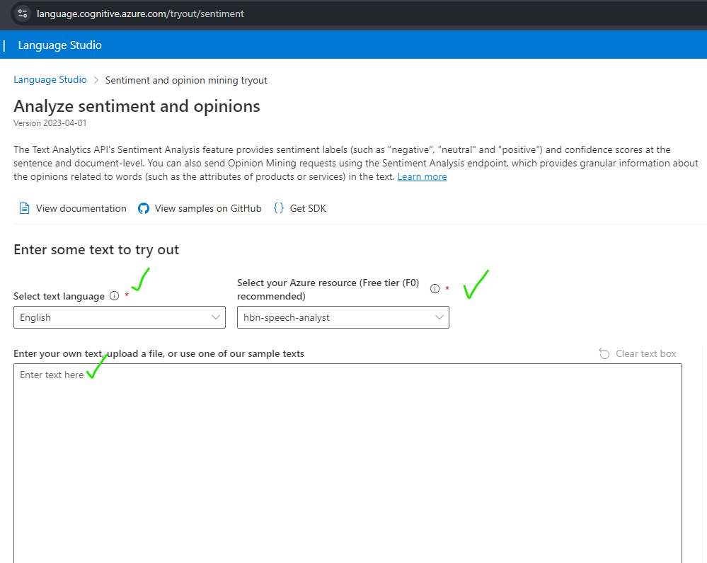
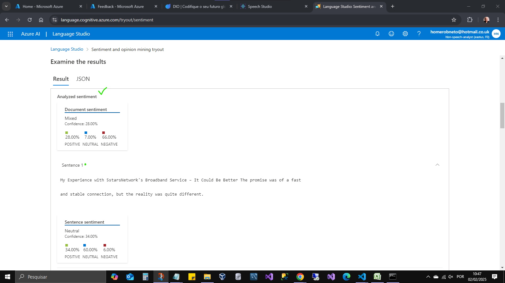

# Analise de Sentimento e Opiniões

## Visão Geral

Este projeto demonstra como utilizar o serviço Azure AI para extrair de reviews de produtos ou serviços informação de valor para a organização rever, melhorar ou adequar seus processos e procedimento produtos e serviços a fim de diminuir a insatisfação dos seus públicos(internos ou externos).

## Casos de uso:

- A coleta poderia se dar para fim de aperfeiçoamento nas tarefas dos departamentos: CRM, Marketing, RH Retenção, Planejamento, Desenvolvimento de Produtos, etc.

## Pré-requisitos

- Assinatura ativa do Microsoft Azure. [https://azure.microsoft.com](https://azure.microsoft.com).
- Recurso: Language

## Etapas para Execução

- Acesse o recuso Language: [https://language.cognitive.azure.com/home](https://language.cognitive.azure.com/home).
- Selecione Analyze sentiment and opinions [https://language.cognitive.azure.com/tryout/sentiment](https://language.cognitive.azure.com/tryout/sentiment).

## Obter informações

- 1 Selecione o idioma da amostra.
- 2 Selecione a implantação do recuso Language criado no Portal Azure.
- 3 Entre com sua amostra.

- 4 Reconheça que o uso do recurso poderá incidir em custos.
- 5 Clique no botão Run.
- 6 e 7 Dados analisados e extraidos.

## Conteúdos

### inputs: imagens de entrada para processamento.

### outputs: resultados da analise e extração das informações.

[analise-1-sentimento-saida.json](outputs/analise-1-sentimento-saida.json)

[analise-2-sentimento-saida.json](outputs/analise-2-sentimento-saida.json)
